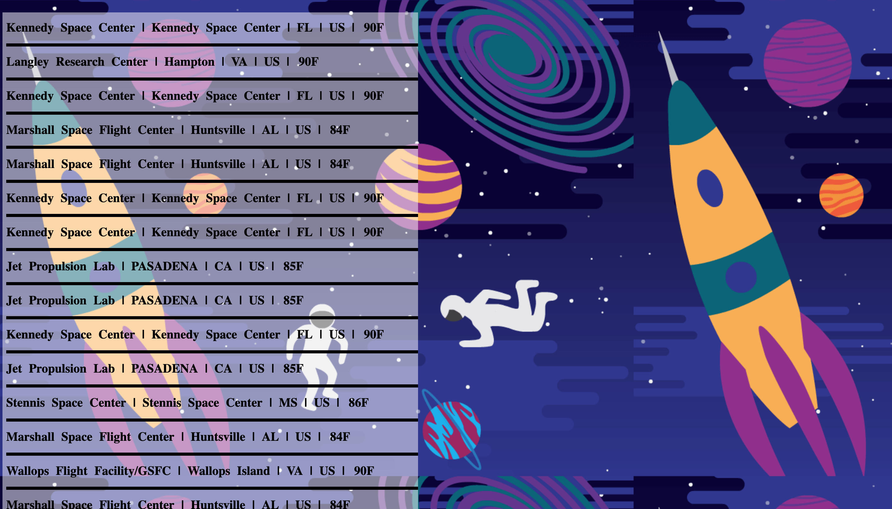

# 🚀 Project: Complex NASA API

### Goal: Use NASA's API to return all of their facility locations (~400). Display the name of the facility, its location, and the weather at the facility currently.

### Preview:



### lessons learned:
```
In this Project I learned, that you could append text nodes that contain the value of a API response. This is very useful when creating a site that fetches a large sum of data from a JASON object and you want to display all the information at once.

```
